# Backpropagation  
- 역전파법(Backpropagation)은 회귀, 분류 등의 목적을 신경망을 이용해 이루기 위한 방법이다. 오차함수의 기울기를 계산해 가중치(Weight)값을 조절하여 학습을 진행한다. (바이어스 값에 대한 설명은 생략하겠다, 학습률을 정의한 상태라고 가정을 한다)

1. forward propagation(순전파)를 진행한다.  
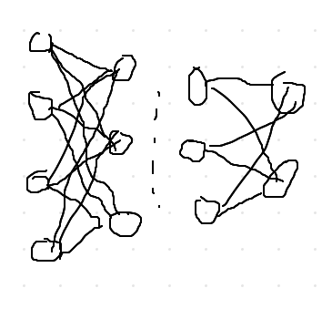
2. 라벨 값과 순전파를 진행한 결과를 비교하여 오차함수를 구한다.  
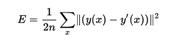  
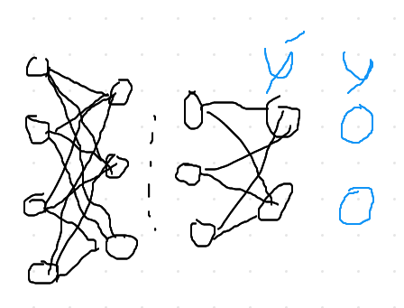
3. 층의 가중치(Wij)에 대한 오차함수(E)의 편미분 즉 기울기를 구한다.  
- 가중치에 대한 오차함수의 편미분 즉 기울기를 구한다.  
- 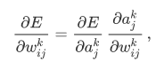  
- En값 즉 오차값은 출력부분 부터 전달 되는 것이다. l번째 층과 l + 1번째 층의 입력에 대한 미분이 있는 것에 착안하여 아래에 식으로 한다.  
- 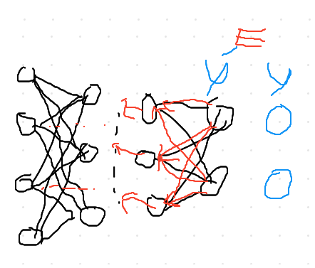  
- 위 식에 첫번째 항을 델타(delta)라고 부르겠다. 델타 값은 앞 레이어 델타값을 통해 계산할 수 있다.  
- 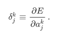  
- 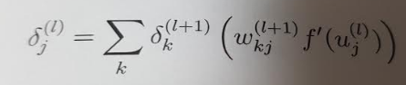  
- 두 번째 항을 미분하면 간단하게 다음과 같이 간단하게 계산 할 수 있다.  
- 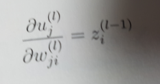  
- 이제 기울기 식을 정리하면 다음과 같다.  
- 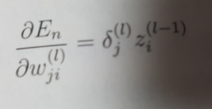  
- 그리고 출력층 텔타는 다음과 같다.  
-   
4. 구한 기울기를 학습률과 곱해서 층의 가중치에 뺀 값으로 가중치를 업데이트 시킨다.  
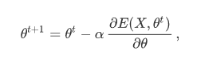  
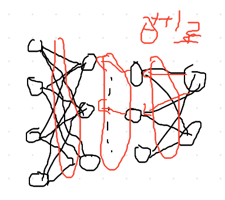  
5. 3~4를 마지막 층까지 진행한다.  

6. 1~5를 원하는 정도의 오차값이 나올 때 까지 반복한다.
