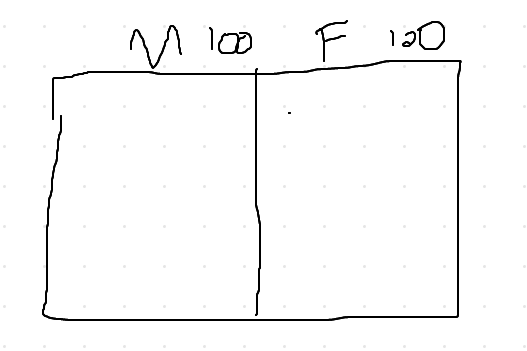

# Bayes theorem  

1. 남자 100명 여자 100명이 있는 곳에서 머리가 짧은 사람이 남자일 확률과 여자일 확률을 구한다고 가정해보자.  

2. 남자 중에 90명이 짧은 머리(s)고 10명이 긴 머리(l)이며 여자 중 50명이 짧은 머리(s) 50명이 긴 머리(s)라고 가정하자.  

3. 이때 머리가 긴 사람이 지나갈 때 여자일 확률과 남자일 확률을 구해보자.  

4. 이제 위에 나온 데이터를 가지고 아래의 식에 대입해보자.  
  
5. 긴 머리인 사람이 여자일 확률이다.  

