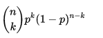
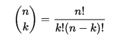
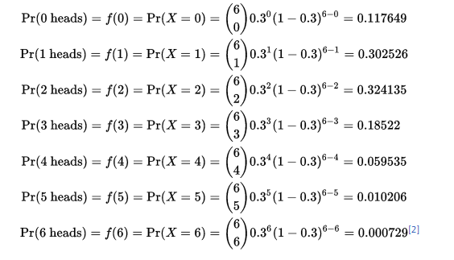

# Binomial distribution  
n번의 독립실행에서 성공확률과 실패확률을 통해 분포를 알아내는 것이다.

공식은 다음과 같다.  
  
P는 성공확률이며 x는 성공횟수이다. 1에서 성공확률을 뺀 것은 실패확률이고 n에서 성공횟수를 뺀 것은 당연히 실패확률이다.  
  
앞에 식은 다음과 같다. 

## 예시  
앞면이 나올 확률이 30%인 편향된 동전을 던진다고 가정해보자. 이때 동전을 6번 던져서 앞면이 0,1, ..., 6 나올 확률이 얼마나 되는가?  

참고
> https://en.wikipedia.org/wiki/Binomial_distribution
