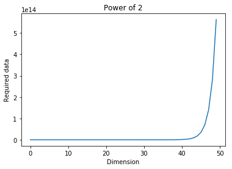

# Curese of dimension  
차원의 저주(Curese of dimension)란 차원이 증가할 수록 필요한 크기가 기하급수적으로 증가하는 것을 말한다.

한 예로 2^1 = 2고 2^2 = 4, 2^3 = 8 ... 2^10 = 1024 ... 2^50 =1.1258999e+15	

기하급수적인 상승은 매우 위험하다. 일단 계산에 필요한 속도 문제도, 정확도가 크게 감소하는 등 여러 문제가 생긴다.  
