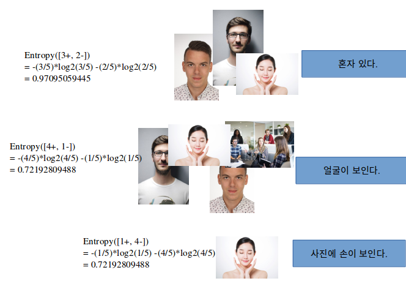

# Decision tree  

1. 증명사진을 찾는 의사결정 트리를 만든다고 가정을 한다.  
  
2. 의사결정 트리(Decision tree)는 보통 여러번의 2진 분류를 통해 결정을 내린다.  
  
  
  
3. 이제 ID3 알고리즘을 이용해서 엔트로피를 구해 최적의 트리를 생성 순서를 만든다. (엔트로피는 복잡성을 이야기한다)  
  

4. p는 yes값 q는 no 값으로 위 식에 대입을 하면 아래와 같다.  
  
5. 이제 엔트로피가 가장 높은 것을 첫번째 트리의 조건으로 놓자.

관련 강의  
> https://www.youtube.com/watch?v=UPKugq0fK04
