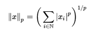
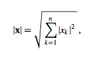
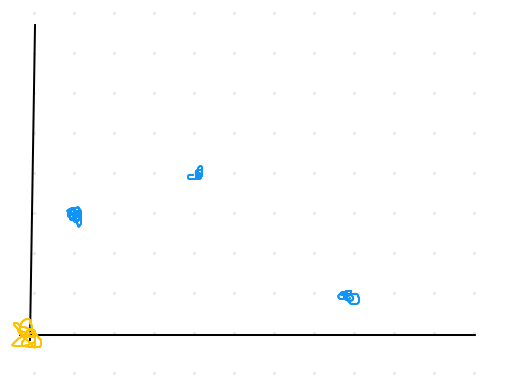
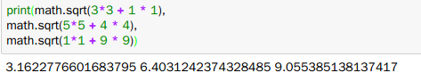

# L2 norm  
norm 이란 백터의 크기를 측정하는 것 (절대 값을 취한 값을 모두 더하는 것이다.)  

위에 식에 p값을 2로 한 것은 L2 norm이라고 말합니다.  

피타고리스의 정리와 같다. x축과 y축을 통해 2차원 공간에서 점과 점 사이의 크기도 구할 수 있다.  
  
  
가장 오른쪽에 있는 파랑 점이 노랑점과 가장 멀다.
