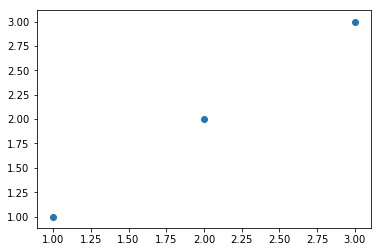
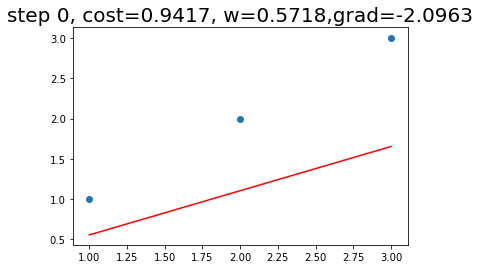
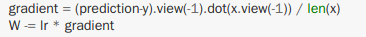
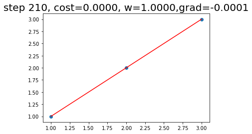

# Linear regression  
데이터에 적합한 선형 모델을 찾는 기법이다. (Naive Model만 설명하겠다)

1. 아래와 같은 데이터가 있다고 가정하겠다.  
  
2. 위 데이터에 맞는 모델을 찾기 위해 Y = aX 함수를 찾아야 한다. X의 시작은 랜덤하게 정의하겠다. a = 데이터의 x축 값이다.  
  
3. 모델과 실제 값의 차이를 구하는 gradient를 정의한다. Linear regression 함수를 적용한 모델을 prediction, 데이터 값을 y라고 하겠다.  
4. Backpropagation같이 학습률과 gradient를 곱해서 기존 모델에 값에서 뺀다.  

5. 3~4번을 원하는 만큼 혹은 모델이 만든 값과 실제 값의 차이가 매우 적어질 때 까지 반복한다.  

PyTorch Code  
> https://github.com/newhiwoong/PyTorch/blob/master/03_Linear_Regression_Models.ipynb

