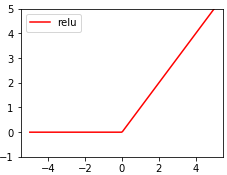

# ReLU  
Rectifide Linear Unit

아래 그림과 같이 0이하면 0으로 0이상이면 항등함수로 사용하는 아주 간단한 활성함수이다.  

요즘 Sigmoid보다 훨씬 많이 쓰인다. Sigmoid는 1보다 작거나 0에 가까운 값으로 Deep Learning에 Backporpagation을 여러번 진행하다 보면 Vanishing gradinet가 발생한다. 

0~1 사이 값을 계속 곱하면 점점 0에 가까워 질 것이다. Hidden Layer가 많으면 많을 수록 여러번 곱해야 할 것이다.

ReLU의 경우 여러번의 Backporpagation을 진행해도 Vanishing gradient가 훨씬 적게 발생한다.

Leaky ReLU, Maxout, ELU 등 0~1 사이 값이 아닌 선형 값을 사용하기도 한다.

관련강의  
> https://www.youtube.com/watch?time_continue=86&v=cKtg_fpw88c
