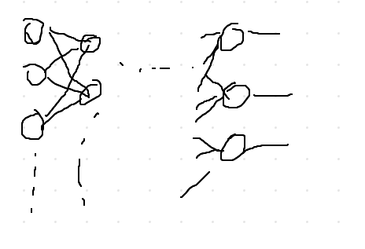
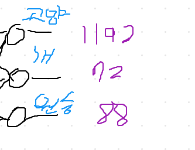
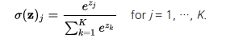

# Softmax  
주로 n-class classification에 출력층 활성화 함수로 많이 쓰인다.

1. 학습을 한 후 분류를 시작한다.  
  
2. 분류 결과 고양이가 1192, 개 72, 원숭이 88 만큼의 값이 나왔다고 가정하겠다.  
  
3. 원숭이일 확률이 몇%인지고양이일 확률이 몇%인지 알기 위해 softmax함수를 적용 시킨다. (위 값(Zj)을 e의 제곱으로 하여 확률을 구한다)  
  
4. 위 식을 적용시키면 값이 0~1사이에 값으로 정의된다. 이후 가장 높은 확률의 요소로 분류 값을 출력하면 된다. (이 예시에서는 고양이이다)

sigmoid화 시키며 값을 0~1사이로 값을 만든다. 특이치 데이터의 큰 영향을 줄이며, 데이터의 중요성을 유지시킨다.
