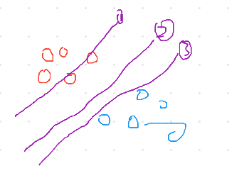
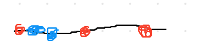

# Support vector machin  
일반적인 머신러닝 알고리즘의 목적인 오류율 최소화과 다르게 이와 더불어 여백 최대화로 일반화를 하려는 알고리즘이다.  
  
이때 (1)은 2개를 오분류 하였다. (2)와 (3)은 오분류가 없지만 SVM안에서는 여백이 더 적은 (2)가 (3)보다 좋은 분류이다.

## 비선형 분류  
아래와 같은 상황을 분류해야한다고 해보자 하지만 어떤 선을 그어도 오분류가 나타난다.
  
-5 -1 0 +5 +7 이라고 하자.

이때 Y축을 만들어서 즉 2차원을 통해서 분류를 한다면 분류가 가능할 것이다.  
(x = x, y = |x|)라는 식으로 만들어보자.  
  
이제 분류 가능한 선을 그어 비선형 분류가 가능해졌다. 이를 커널트릭이라고 부른다.
