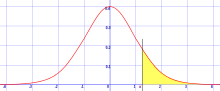

# p-value  
유의확률이라고 하여 기준이 5%라고 할 때 5보다 차이가 작으면 통계에 유의한 차이가 있다고 크면 유의한 차이가 없다고 생각할 수 있다.  
  
노랑색 부분안에 있으면 귀무가설을 기각 흰색 부분이면 채택한다.

예시로 유의수준이 5%라고 가정하겠다.  
이때 운동선수의 달리기 속도와 일반인의 달리기 속도가 다르다라는 가설을 세우겠다.  
데이터를 수집하여 이때 가설이 틀릴 확률이 1%라는 결과가 나왔다고 하자.  
그럼 99%로 흰색부분(95%)안에 있어 즉 귀무가설을 기각한다.
